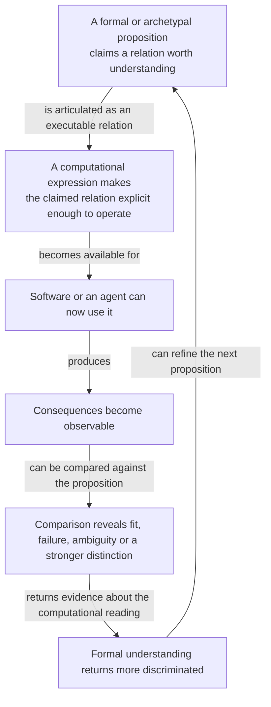
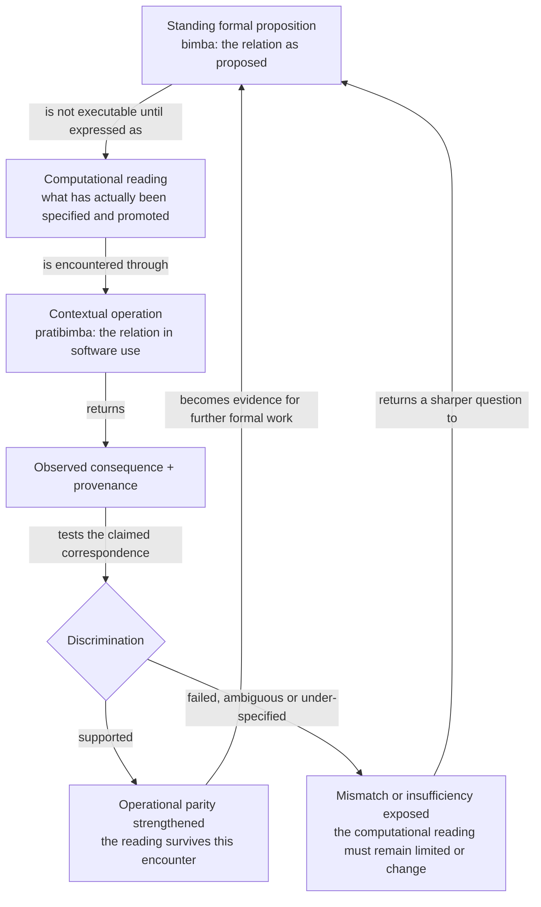
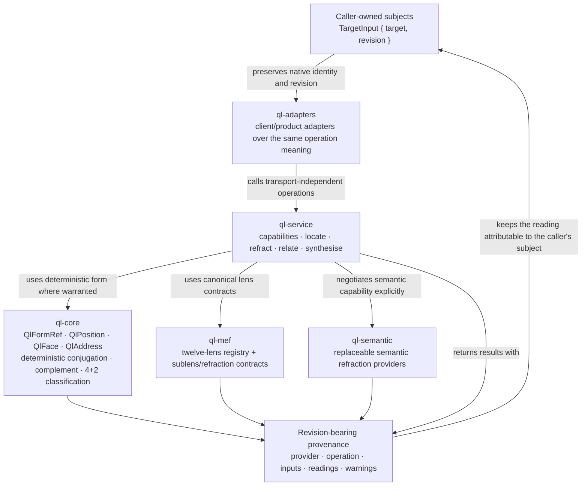

# Quaternal Logic Visual Product Understanding

**Status:** canonical product-understanding surface for the standalone executable product  
**Architecture status:** accepted `main` Q1–Q4 product seams; deeper pairing/rotation/context-frame work on draft PR #19 and Epi relation research on draft PR #27 are not current implementation  
**Sources:** repository `README.md`, Q1–Q4 implementation documents, current Rust crates, and the formal QL/MEF source corpus used for evidence-led promotion.

Quaternal Logic is easiest to misrepresent by beginning with an “engine” box or unexplained coordinate notation. The product reason comes first: formal propositions should be capable of computational expression, encounter consequences in software and agentic operation, and return discriminating evidence to formal understanding.

## 1. Experience — formal ideas can be made operable and answer back



The human or agent gains more than a vocabulary. A sufficiently specified relation can become a deterministic operator, semantic refraction or experimental hypothesis whose consequences can be inspected rather than merely asserted.

## 2. Product / conceptual relation — bimba and pratibimba as experimental relation

The deeper corpus names the standing/formative side **bimba** and its contextual/material articulation **pratibimba**. The terms are useful here only because they keep the return relation visible; they are not prerequisites for ordinary use.



Material experiments do not automatically determine QL canon. They discriminate **how well a particular computational expression realises or tests a formal relation**. This is why the repository has an explicit research firewall and evidence-led promotion process.

## 3. Historical precedent — world-understanding made operable

The history of computational astronomy provides a useful orienting precedent for the **kind of move** described above.

The Alfonsine Tables and the wider medieval `zīj` tradition joined developed mathematical astronomy, numerical tables and procedural **canons** through which a practitioner could compute situated astronomical results such as the positions of the Sun, Moon and planets.

At the relevant level of abstraction:

```text
world-account / mathematical astronomy
        ↓
computational representation
        ↓
tables + procedures of use
        ↓
situated inputs
        ↓
determinate result
        ↓
practical judgement / revision
```

This historical form makes one important product relation concrete: **an account of relations can become an instrument which operates and answers back through inspectable consequences**.

The precedent is a Figure, not evidence for Quaternal Logic's formal claims. Historical astronomy does not validate QL operators, MEF semantics or Epi-Logos correspondences by analogy. The value is orientation toward a recognisable class of technical object.

The fuller Epi-Logos use of this Figure belongs to the Epi integration programme, where it illuminates the Current Situated Matheme and especially the M2 Paraśakti → M3 Mahāmāyā → M4 Nara relation. Standalone Quaternal Logic only needs the more general precedent above.

Historical references used by that integration work include:

- Oxford Cabinet, *Tabule astronomice Alfonsi Regis (Venice, 1492)*: <https://www.cabinet.ox.ac.uk/node/9821>
- José Chabás & Bernard R. Goldstein, *The Alfonsine Tables of Toledo*: <https://link.springer.com/book/10.1007/978-94-017-0213-3>

## 4. Architecture — accepted standalone executable surface



The architecture separates deterministic structure from semantic inference. `locate` may return ambiguity or insufficient information; semantic operations expose disclosure/confidence rather than laundering model judgement into deterministic fact. Current `main` does not include draft Q6 pairing, MEF rotation or context-frame promotion as accepted product truth.

## 5. Diagram audit

| Existing visual | Class | Disposition |
|---|---|---|
| formal torus/Klein, 4+2, 6+6, bimba/pratibimba and musical/topological diagrams in source corpus | specialist formal / research | **Preserve.** They are deeper native formal topology and derivation, not ordinary product onboarding. |
| Q1 deterministic form tables and address examples | implementation/formal | **Preserve.** They prove the exact promoted deterministic subset. |
| Q2 MEF registry tables | specialist formal/architecture | **Preserve.** They establish canonical lens coordinates without making all lens semantics required for first contact. |
| Q3 provider/service operation descriptions | architecture | **Preserve.** The new architecture diagram composes them into one ownership/provenance view. |
| Q4 client adapter maps and cross-repo fixtures | integration architecture/evidence | **Preserve.** They prove “alignment, not translation” at specific client seams. |
| draft Q6 and Epi/O:I relation maps | research/current development | **Do not present as current architecture.** Keep draft status until accepted. |

## 6. Verification

**Semantic:** a reader can explain Quaternal Logic as an experimental relation between formal proposition, computational expression, operation and returned discrimination without knowing QL notation first.

**Historical orientation:** a reader can use the Alfonsine/zīj precedent to recognise the general move from a developed relational account into an operable computational instrument while stating clearly that the analogy does not validate QL or Epi formal propositions.

**Implementation:** the architecture names accepted Q1–Q4 crates and operation families only. It keeps deterministic and semantic provider status distinct and preserves caller refs/revisions.

**Cross-product:** Quaternal Logic is not a decorative reasoning framework because its accepted product surface contains executable forms, service operations, provider negotiation, provenance and conformance. It also does not own Factory Runs, AIKit ContextResolution, Actuation identity, Central Control or Workcell materialisation.

## 7. Public-site projection

Project the **formal proposition → computational expression → consequence → discrimination → return** relation for ordinary audiences. The historical precedent can be used where it helps make the kind of technical object intelligible. A deeper specialist section may reinterpret the bimba/pratibimba diagram and link into native topology, MEF and musical derivations. The richer M2→M3→M4 Alfonsine Figure belongs to Epi product understanding rather than standalone QL onboarding.
